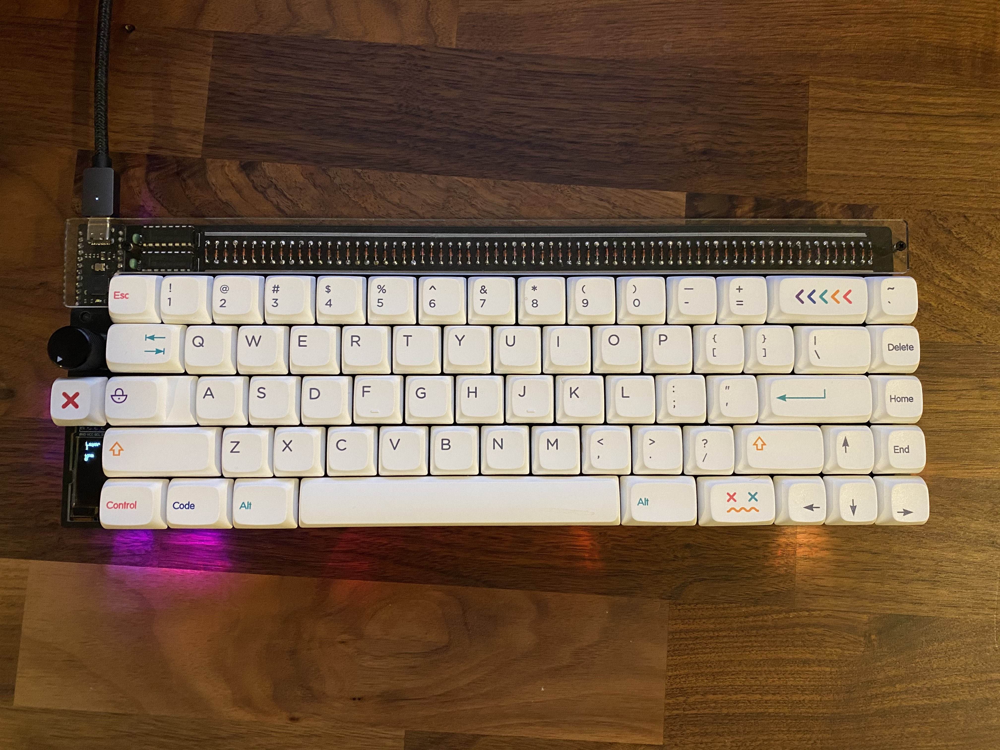

# Quantum Mechanical Keyboard Firmware

My fork of the qmk firmware with my own personal keymaps.

My build, if you're interested:

- Nullbits Nibble 65% Kit with Nullbits FR4 Plate
- Nullbits Bit-C
- NP PBT Crayon Caps with O rings
- Holy Panda switches, Tribosys 3204 on everything but legs, Deskeys films
- Durock V1 Screw-In Stabs with washers, Tribosys 3204 on housings, Permatex 81150 on ends and bends
- Mill-Max 0305 Sockets
